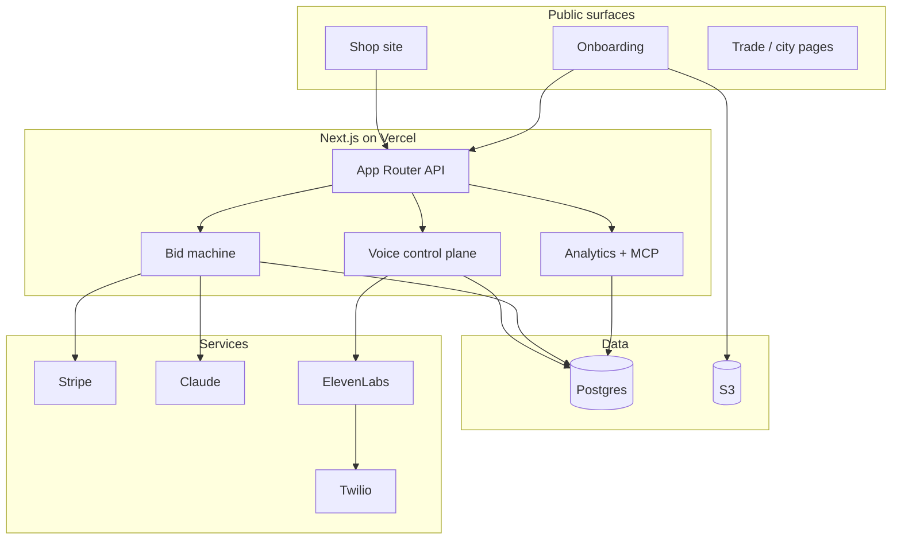
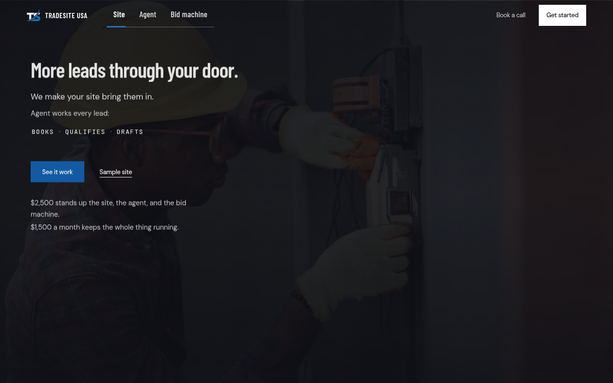
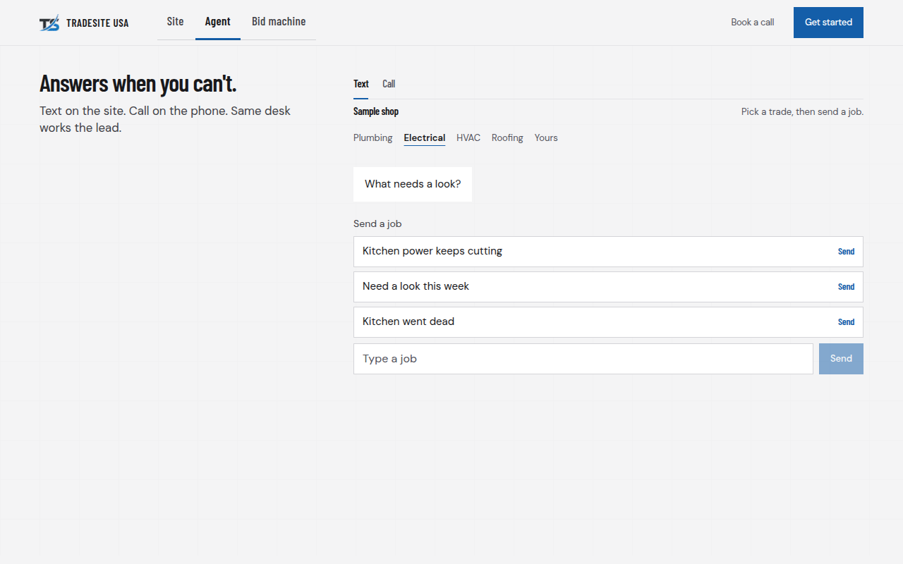
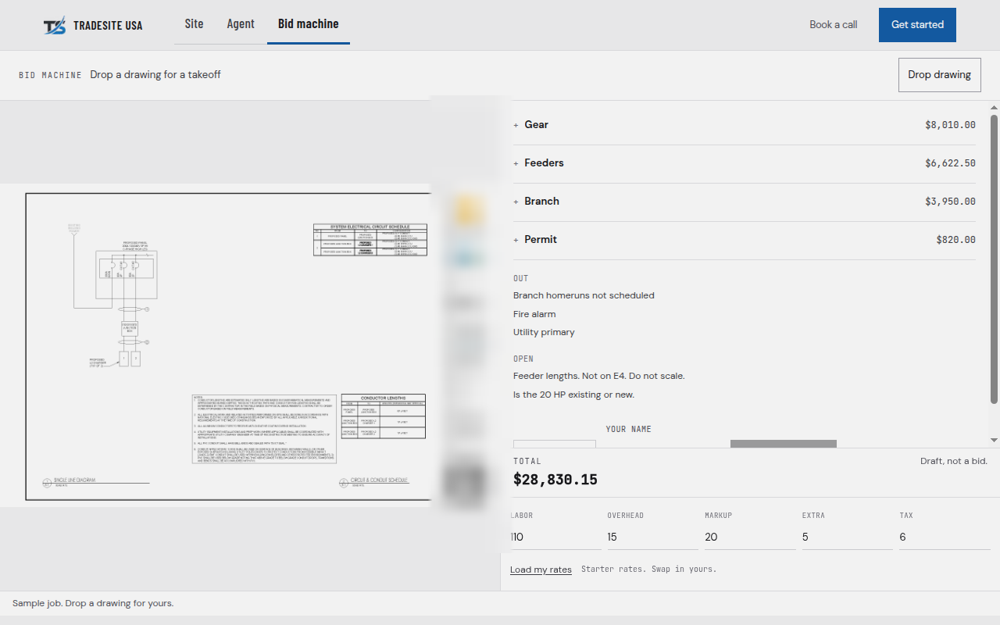

# TradeSite USA case study

**Live product:** [tradesiteusa.com](https://www.tradesiteusa.com)

This repo is a public architecture and product write-up. The production codebase is private (customer data, payments, voice tenants, and GTM ops). The site is real and shipping.

I built TradeSite USA end to end: product, full-stack app, AI agent surfaces, voice control plane, payments, and analytics.

---

## What it is

A digital growth stack for trade shops (HVAC, plumbing, electrical, roofing, and similar):

1. **Site:** lead-generating shop site
2. **Agent:** works every lead on web chat and phone (Night Line)
3. **Bid machine:** drawings in, priced draft out, human signs before it leaves the desk

One package. Not three disconnected tools.

Try the public demos:

| Surface | URL |
| --- | --- |
| Door | https://www.tradesiteusa.com |
| Agent (text + call proof) | https://www.tradesiteusa.com/agent |
| Bid machine | https://www.tradesiteusa.com/bids |
| Sample site | https://www.tradesiteusa.com/site |
| Start intake | https://www.tradesiteusa.com/start |

---

## Why the source stays private

- Multi-tenant voice and payment paths with live credentials and shop configs
- Prospect research, outreach, and owner ops that hold third-party data
- Product IP (prompts, rate books, quality gates) that is the business

What you get here instead: stack, architecture, engineering constraints, and links to the working product.

---

## Stack

| Layer | Choice |
| --- | --- |
| App | Next.js 15 (App Router), React 18, TypeScript, Tailwind |
| Data | PostgreSQL, Prisma |
| Hosting | Vercel |
| Payments | Stripe Checkout + webhooks |
| Cloud | AWS S3 (uploads), SES (email), SNS (SMS) |
| AI | Anthropic Claude (chat, research, bid drafting) via AI SDK |
| Voice | ElevenLabs agents + Twilio DIDs / SMS |
| Auth | NextAuth v5 |
| Analytics | First-party event store, GA4, Meta Pixel/CAPI, Clarity |
| Ops AI | Hosted MCP board so a copilot reads live metrics |

Details: [STACK.md](./STACK.md) · Architecture: [ARCHITECTURE.md](./ARCHITECTURE.md) · Decisions: [DECISIONS.md](./DECISIONS.md)

---

## Engineering highlights

### 1. Voice control plane, not a chatbot demo

Night Line maps a shop DID to tenant config, runs tool webhooks for leads / windows / hours / owner ping, and stores calls and leads in Postgres.

Call flow is **server-enforced**: `greet → qualify → propose → confirm`. Booking modes (`autonomous` / `qualify` / `assist`) gate whether the model can propose a look. Webhooks are HMAC-verified. Golden evals cover the workflow.

### 2. Bid desk with a hard human gate

Upload drawings or PDFs → draft takeoff against a rate book → totals and exports → Stripe look fee → **signed draft before any Jobber push**. The model drafts. A person owns the number that leaves the shop.

### 3. Product and pricing as code

Owner-facing copy and dollar amounts live in typed modules. UI components do not invent CTAs or prices. An anti-slop lint fails hype language and em dashes before ship.

### 4. Analytics board + MCP

First-party collection with attribution fan-out. Pin-gated owner board. MCP + OAuth so Claude (or similar) can query live counts instead of guessing.

### 5. Abuse-resistant intake

Zod schemas, upload validation, rate limits, honeypots, and chat field allowlists on public forms and agent surfaces.

### 6. Research → quality gate → proposal

Crawl and dossier pipeline for outreach, with a confidence gate before proposal or PDF generation. Built to stop junk AI outbound, not to maximize send volume.

---

## Architecture (high level)

---

## Role fit

This project maps cleanly to:

- Full-stack / product engineer (Next.js, Postgres, Stripe, AWS)
- AI application engineer (tool-using agents, evals, human-in-the-loop)
- Founding / 0→1 engineer (vertical SaaS, owned GTM loop)

I care about constraints: modes, signatures, HMAC, typed product surface. Demos that skip those are easy. Shipping them is the job.

---

## Screenshots

Captured from the live product (public pages only).

The bid screenshot is the live takeoff UI. The drawing title block (logos, PE seal, address) is blurred. Door and agent shots are unchanged sample product UI.

More capture notes: [`assets/README.md`](./assets/README.md).

---

## Contact

- Email: IsaacBrendel1@gmail.com
- LinkedIn: https://www.linkedin.com/in/isaacbrendel
- Site: https://www.tradesiteusa.com
- GitHub: https://github.com/isaacbrendel
